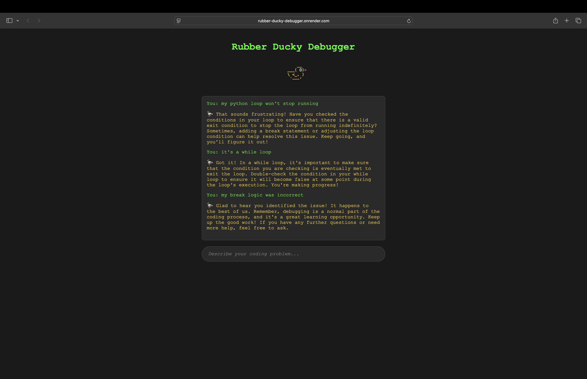

# 🦆 Rubber Ducky Debugger

An AI-powered rubber duck that actually talks back! Built for Giffith University ICT club hackathon.

## Live Demo
🌐 **[Try it here: rubber-ducky-debugger.onrender.com](https://rubber-ducky-debugger.onrender.com)**

## What it does
Traditional rubber duck debugging is one-way - you talk to a silent duck. What if your duck actually responded with helpful questions and remembers your conversation?

- Real-time AI conversations about your coding problems
- Remembers conversation history
- Asks clarifying questions like a real debugging partner

## Tech Stack
- Frontend: HTML, CSS, JavaScript
- Backend: Flask (Python)
- AI: OpenAI GPT-3.5 Turbo
- Deployment: Render

## Features
- 🎨 Beautiful dark theme with ASCII art duck
- 💬 Persistent conversation memory
- 📱 Mobile-friendly interface
- ⚡ Real-time responses

## Setup
1. Clone the repo
2. `pip install -r requirements.txt`
3. Add your OpenAI API key to `.env`
4. `python app.py`
